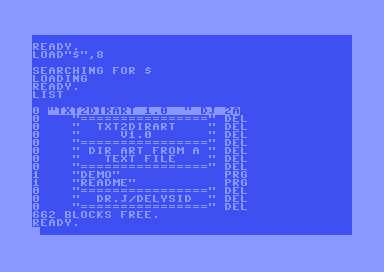
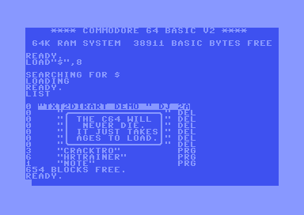
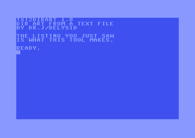

# txt2dirart

Stamp C64 **directory art** onto a `.d64` from a plain text file.

No dependencies, no install, no GUI. One file in, one disk out. Windows and Linux binaries need nothing on the machine — not even Python.

```
$ txt2dirart game.d64 --from-text art.txt -o release.d64

    0 "DR.J/DELYSID    " DJ 2A
    0 "================" del
    0 "   DR.J/DELYSID " del
    0 "================" del
    3 "CRACKTRO        " prg
    6 "HRTRAINER       " prg
    1 "NOTE            " prg
```

The listing draws a picture. The files still load.

And on the actual machine — this is `examples.d64`, which ships with the release:



---

## Contents

- [What directory art is](#what-directory-art-is)
- [Why this exists](#why-this-exists)
- [Install](#install)
- [Quick start](#quick-start)
- [The art file](#the-art-file)
  - [Art rows](#art-rows)
  - [`@tokens` — putting files inside the art](#tokens--putting-files-inside-the-art)
  - [`\xNN` — PETSCII characters you cannot type](#xnn--petscii-characters-you-cannot-type)
- [Command line](#command-line)
- [Exit codes](#exit-codes)
- [Recipes](#recipes)
- [Verifying it worked](#verifying-it-worked)
- [How it works](#how-it-works)
- [Limitations](#limitations)
- [Building from source](#building-from-source)
- [Credits](#credits)

---

## What directory art is

A 1541 directory is a chain of 32-byte entries living on track 18. Each entry has a file type, a start sector, a 16-character name and a block count.

If you write an entry whose type is a **closed DEL** (`$80`) with a block count of **zero**, the drive lists it like any other entry — but it owns no sectors, points at no data, and loading it does nothing. It is a free row of 16 characters in the listing.

Sixteen characters wide, as many rows as track 18 has room for. That is your canvas. That is directory art.

The C64 scene has been doing this since the eighties. This tool just makes it scriptable.

## Why this exists

The existing options all have a catch:

| | catch |
|---|---|
| **DirMaster** | Windows GUI. Excellent, but you cannot call it from a build script. |
| **Sparkle** `DirArt:` | Only if your production is built with Sparkle. |
| **c1541** | No dir-art support at all. |
| **A hex editor** | Works. Once. |

`txt2dirart` is a CLI that stamps art onto a disk that has **already been mastered**. It runs on Windows and Linux, takes a text file you can keep in version control, and — the part nothing else does — can place your real files *inside* the art rather than below it.

## Install

**Binaries** (nothing else needed) — grab the zip from [Releases](https://github.com/turrican128/txt2dirart/releases):

```
txt2dirart.exe          Windows
txt2dirart              Linux x64
```

Drop it anywhere on your `PATH`.

**From source** — any Python 3.9 or newer, no packages required:

```
python txt2dirart.py game.d64 --from-text art.txt -o release.d64
```

The whole tool is one file. You can vendor it into your project and forget about it.

## Quick start

Write an art file:

```
================
   DR.J/DELYSID
================
```

Preview what it will do — this writes nothing:

```
$ txt2dirart game.d64 --from-text art.txt --dry-run
```

Then stamp it:

```
$ txt2dirart game.d64 --from-text art.txt
```

`game.d64` now lists your art above the files.

**Directory art already on the disk is replaced, not added to** — separators made in DirMaster or any other tool included. Every `DEL` entry that owns no blocks counts as art: the tool removes them all and writes yours. Your real files are always kept. This is what makes stamping repeatable: edit the text file, stamp again, and the disk matches the file instead of collecting a second copy of the art.

To leave the original alone and write a new disk instead:

```
$ txt2dirart game.d64 --from-text art.txt -o release.d64
```

> **Stamping in place is safe.** Only track 18 is ever rewritten. Every file keeps its start sector and its length, so the worst outcome is a listing you do not like — and you fix that by stamping again.

## The art file

One line per directory row, top to bottom. Plain text, any editor, LF or CRLF.

### Art rows

- Up to **16 characters**. Longer is an error naming the line number — it is not silently truncated, because a truncated row is art you did not draw.
- Lowercase is **uppercased**. The C64's default character set has no lowercase; leaving it alone would give you graphics characters instead of letters.
- A **blank line** is a full-width blank row.
- Blank lines at the **end** of the file are dropped. They are almost always trailing newlines rather than deliberate spacing.
- Rows are padded with real spaces (`$20`), not `$A0`. A row padded with `$A0` lists as an *empty name* rather than the full-width row you drew — a classic dir-art bug.

```
----------------

   DR.J PRESENTS

----------------
```

### `@tokens` — putting files inside the art

A line starting with `@` is not art. It means **"put the real file with this name here."**

```
 ..............
 . DR.J/DELYSID
 ..............
@cracktro
 ..............
@hrtrainer
 ..............
    2026
```

gives

```
    0 " .............. " del
    0 " . DR.J/DELYSID " del
    0 " .............. " del
    3 "CRACKTRO        " prg      <- the real file, in the middle of the art
    0 " .............. " del
    6 "HRTRAINER       " prg
    0 " .............. " del
    0 "    2026        " del
    1 "NOTE            " prg      <- not named by a token, so appended
```

Notes:

- **A token names a file on the disk you are stamping.** Art written for one disk will not run against another without renaming its tokens — that is the single most common thing to trip over, including with the files in `art-examples/`, whose tokens name files on the test disk.
- Tokens are **case-insensitive**. `@cracktro`, `@CRACKTRO` and `@CrAcKtRo` are the same.
- A token naming a file that is not on the disk is an **error**, and **every** bad token is reported at once, together with what *is* on the disk:

  ```
  !! 2 token(s) match no file on the disk: @CRACKTRO, @HRTRAINER
     the disk contains: TCOM-10
     a token names a file on THIS disk, so art written for another disk needs
     its tokens renamed
  ```

  Nothing is written when it stops like this. A silent miss would mean shipping a listing with a hole in it.
- Naming a file **more times** than the disk has copies of it is also an error, rather than one of them silently vanishing.
- Any real file you do **not** name is appended at the end, and the tool says so. A typo in your art can never drop a file off the disk.
- Use no tokens at all and you get art-then-files (or `--file-first` for files-then-art).

### `\xNN` — PETSCII characters you cannot type

Dir art is built from PETSCII graphics characters — bars, corners, blocks — and your text editor cannot type most of them.

`\xNN` writes PETSCII byte `NN` directly. This is `art-examples/03-petscii-escapes.txt`, a rounded frame:

```
\xd5\xc0\xc0\xc0\xc0\xc0\xc0\xc0\xc0\xc0\xc0\xc0\xc0\xc0\xc0\xc9
\xdd THE C64 WILL \xdd
\xdd  NEVER DIE.  \xdd
\xdd IT JUST TAKES\xdd
\xdd AGES TO LOAD.\xdd
\xca\xc0\xc0\xc0\xc0\xc0\xc0\xc0\xc0\xc0\xc0\xc0\xc0\xc0\xc0\xcb
@cracktro
```

which lists on the machine as a box with the file sitting under it:



The six codes a frame needs, checked on a real C64 rather than copied from a chart:

| code | glyph | C64 key |
|---|---|---|
| `\xd5` `\xc9` | top corners ╭ ╮ | shift-U, shift-I |
| `\xca` `\xcb` | bottom corners ╰ ╯ | shift-J, shift-K |
| `\xc0` | horizontal line ─ | shift-* |
| `\xdd` | vertical line │ | shift-minus |

A real file cannot sit *inside* the box: its name is padded by the drive, so it has no side walls. Put `@tokens` above or below the frame.

- `\xNN` counts as **one character** against the 16-wide limit, not four. Sixteen escapes is a full row.
- Escaped bytes are **not uppercased**. `\x61` stays `$61`; a literal `a` becomes `A`.
- `\\` is a literal backslash.
- A malformed escape is an error with the line number, never a silently mangled row.

> Earlier versions of this code told you to run a separate Windows-only tool afterwards to fix up the graphics characters. That is gone. Everything is done in one pass, on either platform.

To find the code for a character you want, any PETSCII chart will do — the codes here are the ones the drive sends and the C64 prints, i.e. PETSCII, not screen codes.

## Command line

```
txt2dirart DISK.D64 (--from-text ART.TXT | --from-d64 ART.D64)
           [-o OUT.D64 | --in-place] [--file-first] [--dry-run] [-q]
```

| option | meaning |
|---|---|
| `--from-text ART.TXT` | art file, one line per row |
| `--from-d64 ART.D64` | lift the art off another disk's listing |
| `-o, --out OUT.D64` | write to a new file instead of stamping the input |
| `--in-place` | stamp the input. This is the default; the flag lets a build script say so explicitly |
| `--file-first` | files above the art (default: art above the files) |
| `--dry-run` | print the listing it *would* write, then stop |
| `-q, --quiet` | only report problems |
| `--version` | print the version |

`--from-d64` is how you borrow: point it at any disk whose listing you like and its rows become your art.

## Exit codes

Refusals are typed, so a build script can tell them apart:

| code | meaning |
|---:|---|
| `0` | done |
| `2` | bad command line (argparse) |
| `3` | the image is not a `.d64` we can work with |
| `4` | the art file does not parse |
| `5` | an `@token` names no file on the disk |
| `6` | track 18 is full |

## Recipes

**In a build script**, after mastering the disk:

```sh
c1541 -format "my game,dj" d64 out/game.d64 \
      -write build/cracktro.prg cracktro \
      -write build/game.prg game
txt2dirart out/game.d64 --from-text dirart.txt --in-place || exit 1
```

**Steal a listing you like:**

```sh
txt2dirart mine.d64 --from-d64 theirs.d64 -o mine-arted.d64
```

**Check the art still fits after adding a file:**

```sh
txt2dirart out/game.d64 --from-text dirart.txt --dry-run
```

## Verifying it worked

Three levels, cheapest first.

**1. `--dry-run`.** Shows the listing, including the real disk name, ID and DOS type from the BAM.

**2. `c1541`:**

```sh
c1541 out/game.d64 -list
```

**3. A real drive or an emulator.** Attach the disk and:

```
LOAD"$",8
LIST
```

This is the only check that shows you the actual PETSCII glyphs. Do it once before you release anything — a `\xNN` chosen from the wrong chart looks perfectly fine in `--dry-run` and wrong on a C64.

**And load a file.** The whole point is that the art is free:

```
LOAD"CRACKTRO",8,1
```



This repo automates both checks against `examples.d64`:

```sh
python tools/capture_screens.py      # needs x64sc (VICE) on PATH
```

It writes `docs/listing-on-a-c64.png` and `docs/demo-running.png`. Two gotchas are baked into that script, since both cost an afternoon: VICE's `-keybuf` wants **lowercase** ASCII (uppercase arrives as PETSCII `$C1`–`$DA`, which are graphics characters in the boot charset, and the screen fills with garbage that looks like a disk fault), and the line terminator must be `\n` — a `\r` is typed but never submits.

## How it works

Only **track 18** is ever written. Everything else in the image — every file's data, the other tracks, any error-info block — is returned byte for byte as it came in. The test suite asserts exactly this.

1. Walk the directory chain from track 18 sector 1, collecting every in-use entry.
2. Split them into real files and existing art (DEL entries owning no block), so re-stamping replaces the art instead of piling it up.
3. Build the new entry list: art rows, with real files slotted in at their `@tokens`.
4. Grow the chain along track 18 if the entries need more sectors, taking the BAM's free sectors at the usual interleave of 3 and marking them allocated.
5. Rewrite every sector in the chain, fixing the link bytes — including the two that overlap entry 0's first two bytes.
6. Write to a temp file and `os.replace` it into position, so an interrupted run cannot leave a half-written disk image.

## When the disk does not look right

A `.d64` is 174848 bytes and anything can produce one. An image that was never
formatted walks its directory chain perfectly well and reports no files, which
reads like the tool did nothing rather than like the disk is empty. So it says
so:

```
[!] DOS type is b'  ', not b'2A' -- this image does not look like it was
    ever formatted
[*] 0 real file(s) kept, 3 art rows
[!] this disk holds no files at all -- the listing will be art and nothing else
```

These are warnings, not refusals. Stamping art onto a blank disk is a
legitimate thing to want. But if you did not mean to, you find out now rather
than on the C64.

**The tool never frees a block.** It allocates directory sectors on track 18 and
nothing else, so a disk's free-block count can only stay the same or fall. If a
disk lost its files, it did not lose them here.

## Limitations

- **35- and 40-track `.d64` only** (`174848`, `175531`, `196608`, `197376` bytes). No `.d71`, no `.d81`, no `.g64`.
- **Track 18 is the ceiling.** 18 usable sectors × 8 entries = **144 rows** absolute maximum, shared with your real files, and only if the rest of track 18 is free. You will hit a clean error long before you hit anything weird.
- **It does not draw the art for you.** It takes the art you wrote and puts it on the disk. Authoring is DirMaster, a text editor, or your own head.
- **It does not write files.** Master the disk first with `c1541` or whatever you already use, then stamp it.

## Building from source

```sh
git clone https://github.com/turrican128/txt2dirart
cd txt2dirart
python -m pytest tests/ -q
```

The tests need only Python. The fixture disks are committed as binaries so nothing has to be installed; `python tools/make_fixtures.py --check` rebuilds them with `c1541` and proves the committed copies match.

Release binaries are built by GitHub Actions with PyInstaller on `windows-latest` and `ubuntu-latest`.

## Credits

Code by **DR.J/Delysid**.

Written while cracking *The Human Race* (Mastertronic, 1985) — the crack needed a dir-art step that ran on Linux from a build script, and nothing did that.

MIT licensed. Do what you like with it.
